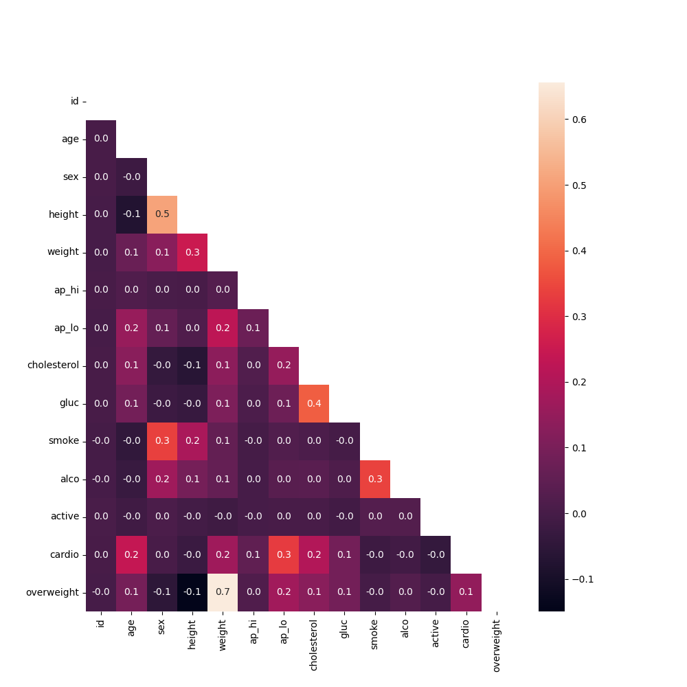
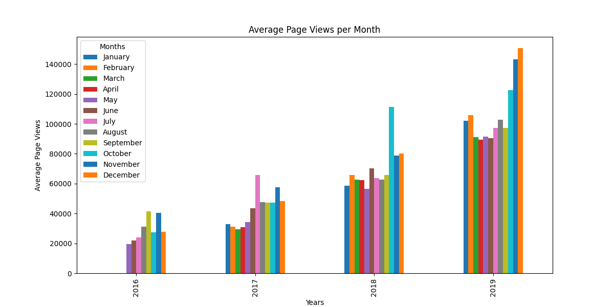
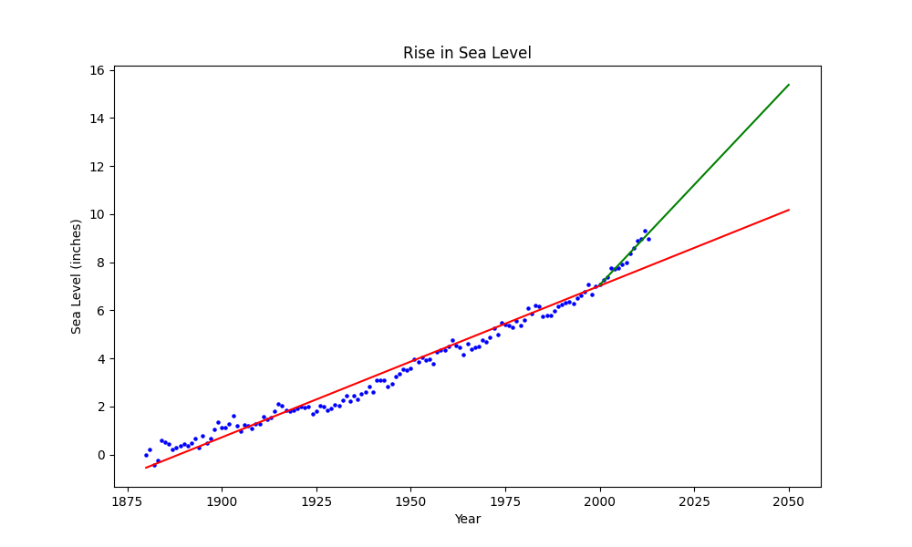

# Portfolio

## About Me  
Hi! I'm **Medrona**, a Biochemistry graduate with a strong interest in data analysis and machine learning.  
I recently completed a **300-hour "Data Analysis with Python" certification** from FreeCodeCamp, where I applied **data cleaning, visualization, statistical modeling, and predictive analysis** in various projects.  

This repository contains my **Python-based data analysis projects**, each demonstrating practical applications of **NumPy, Pandas, Matplotlib, Seaborn, and Scikit-learn**.

---

## 📌 Projects  

### **1. [Medical Data Visualizer](./Medical_data_visualizer/)**  
📜 [Notebook](./Medical_data_visualizer/medical_data_visualizer.py)  
- Processed patient health data to identify trends in **BMI, cholesterol, and blood pressure**.  
- Created **heatmaps, histograms, and categorical plots** for data comparison.  
- Applied **data normalization** for better visualization.  

    
  

---

### **2. [Page View Time Series Visualizer](./Page-View-Time-Series/)**  
📜 [Notebook](./Page-View-Time-Series/time_series_visualizer.py)  
- Processed **time series data** to track long-term web traffic trends.  
- Used **rolling averages and line plots** to detect seasonal patterns.  
- Created **box plots** to visualize daily, monthly, and yearly variations.  

  
  
  

---

### **3. [Sea Level Predictor](./Sea-Level-Predictor/)**  
📜 [Notebook](./Sea-Level-Predictor/sea_level_predictor.py)  
- Built a **linear regression model** to predict future sea level rise.  
- Used **historical climate data** and **Scikit-learn regression** for trend forecasting.  
- Visualized results with **scatter plots and trend lines**.  

   

---

### **4. [Mean-Variance-Standard Deviation Calculator](./Mean-Variance-Standard-Deviation-Calculator/)**  
📜 [Notebook](./Mean-Variance-Standard-Deviation-Calculator/mean_var_std.py)  
- Implemented a function using **NumPy** to compute **mean, variance, standard deviation, min, max, and sum** along both axes of a 3x3 matrix.  
- Optimized calculations with array operations instead of loops.  

---

### **5. [Demographic Data Analyzer](./Demographic-Data-Analyzer/)**  
📜 [Notebook](./Demographic-Data-Analyzer/demographic_data_analyzer.py)  
- Used **Pandas** to analyze U.S. Census data.  
- Computed statistics on **education levels, employment rates, and race distribution**.  
- Applied **group-by operations and aggregations** to extract insights.  

---
## 🔧 Tech Stack  
- **Languages:** Python, SQL  
- **Libraries:** Pandas, NumPy, Matplotlib, Seaborn, Scikit-learn  
- **Tools:** Jupyter Notebook, GitHub  

---

